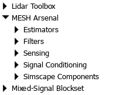

Simulink Arsenal 🛡️
===================

# Overview
`Simulink Arsenal` is your one-stop shop for battle-tested Simulink components, utilities, and workflows.
We've gathered the sharpest tools and strategies for conquering complex system modeling challenges.
Dive in, arm yourself, and build something incredible.

# Contributing
Want to contribute your own powerful tools to the `Simulink Arsenal`? We welcome pull requests!
To ensure the highest quality and maintainability, all new additions must include a comprehensive test harness demonstrating their functionality and robustness.
This helps us keep the arsenal reliable and ready for action.

ℹ️ See the [`CONTRIBUTING.md`](/.github/CONTRIBUTING.md) file for detailed guidelines on submitting your contributions.

# How to integrate the `Simulink Arsenal` in your project
To integrate the `Simulink Arsenal` in your project, you can either clone this repository or add it as a submodule.
The latter option is recommended, as it allows you to easily update the `Simulink Arsenal` to the latest version and keep it embedded in your project.
To this end, follow the MathWorks [instructions](https://www.mathworks.com/help/simulink/slref/organize-project-into-components-using-submodules.html).

Once you have added the `Simulink Arsenal` to your project, you can start using its components via the Library Browser.
The library is called: **MESH Arsenal**.

> [!note]
> Remember that Git does not clone automatically submodules.
> To achieve this, just yield `git clone <your-project-repo> --recurse-submodules` or `git submodule update --init --recursive`.

# Documentation
Check out the individual components [documentation](/docs) 📖

# Maintainers
This repository is maintained by:

|                                                                                         |                                            |
| :-------------------------------------------------------------------------------------: | :----------------------------------------: |
|  | [@pattacini](https://github.com/pattacini) |
