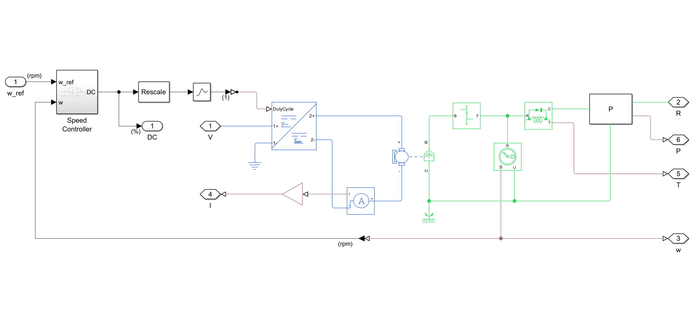
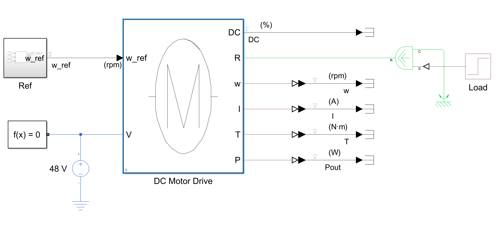
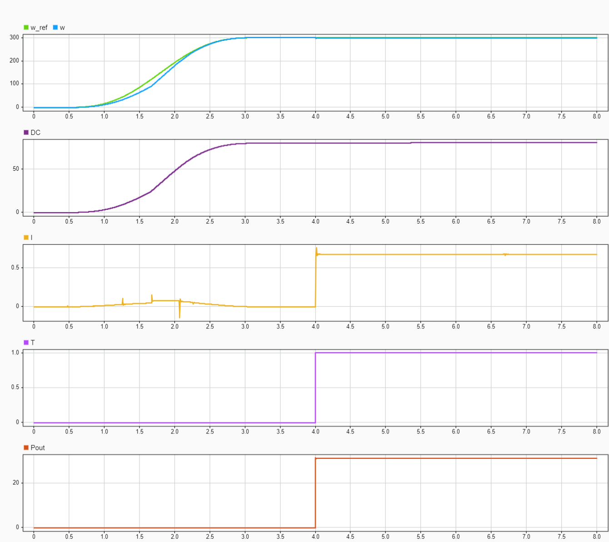

DC Motor Drive
==============

- This component implements the Simscape model of a speed controlled DC motor drive.
- The model incluses a look-up table for the feed-forward term and a PID controller for the feedback term, whose output represents the duty cycle of the PWM signal that drives the motor.

> [!note]
> This model comes in handy for implementing a commercial motor drive whose datasheet is provided.

### Test
You can run the associated test that allows to log and plot the relevant motor quantities.

